<picture>
  <source media="(max-width: 600px)" srcset="./github-profile-systems-atlas-final/profile-atlas-mobile.svg">
  
</picture>

<h1 align="center">Shashank Thota</h1>

<p align="center">
  <strong>AI/ML developer building agentic products and developer tools.</strong><br>
  Hyderabad, India · Turning difficult systems into experiences people can understand and trust.
</p>

<p align="center">
  <a href="https://comic-code.vercel.app"><strong>Launch Comic Code</strong></a>
  &nbsp;·&nbsp;
  <a href="https://github.com/thotashashank302?tab=repositories">Explore the work</a>
  &nbsp;·&nbsp;
  <a href="https://www.linkedin.com/in/thota-shashank-96878934b">LinkedIn</a>
</p>

---

### `> whoami`

```text
I build AI systems where the model, interface and explanation work as one.
Current signal: agentic products · applied ML · developer experience
Operating principle: build useful things, then explain them clearly.
```

## Selected systems

### Comic Code — pull requests become visual stories

**Comic Code** turns selected source files into a grounded four-panel explanation of how the code works. It connects a Chrome side panel, a Next.js product, read-only GitHub integration, private storage and durable background jobs.

`TypeScript` · `Next.js` · `Chrome Extension` · `GitHub Apps` · `Supabase` · `Trigger.dev`

**[Open the live product →](https://comic-code.vercel.app)** &nbsp;&nbsp; **[Read the source →](https://github.com/thotashashank302/Code-Comic)**

### Delinquency intelligence — prediction with a next action

An AI-powered system that predicts credit-card delinquency, assigns a risk band and lets an operator approve an email reminder for moderate-risk customers.

`Python` · `Pandas` · `scikit-learn` · `Random Forest` · `AI Agent`

**[Explore the model and agent →](https://github.com/thotashashank302/Delinquency-Prediction-Model-With-AI-AGENT)**

<details>
<summary><strong>New Life — concept in development</strong></summary>
<br>

An exploratory AI-agent concept for maternal-health awareness: supporting reminders, identifying possible risk indicators and helping escalate concerns to a doctor.

It is not a certified medical product or a replacement for professional medical care.
</details>

---

## Mission telemetry

<p align="center">
  
</p>

<p align="center"><sub>Generated from public GitHub data and refreshed automatically.</sub></p>

## Contribution snake

<picture>
  <source media="(prefers-color-scheme: dark)" srcset="https://raw.githubusercontent.com/thotashashank302/thotashashank302/output/github-contribution-grid-snake-dark.svg">
  <source media="(prefers-color-scheme: light)" srcset="https://raw.githubusercontent.com/thotashashank302/thotashashank302/output/github-contribution-grid-snake.svg">
  
</picture>

<p align="center">
  <sub>The grid is generated from my real contribution history and updates every day.</sub>
</p>

---

<p align="center">
  <strong>BUILD USEFUL THINGS. EXPLAIN THEM CLEARLY.</strong><br>
  <sub>AI systems · Agentic products · Developer tools</sub>
</p>
