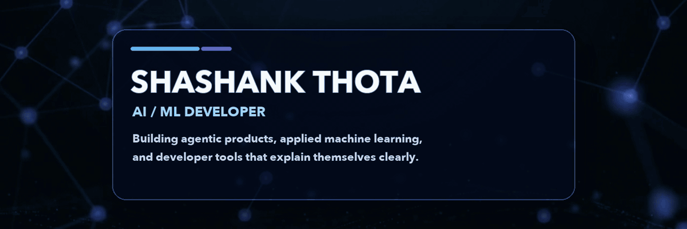
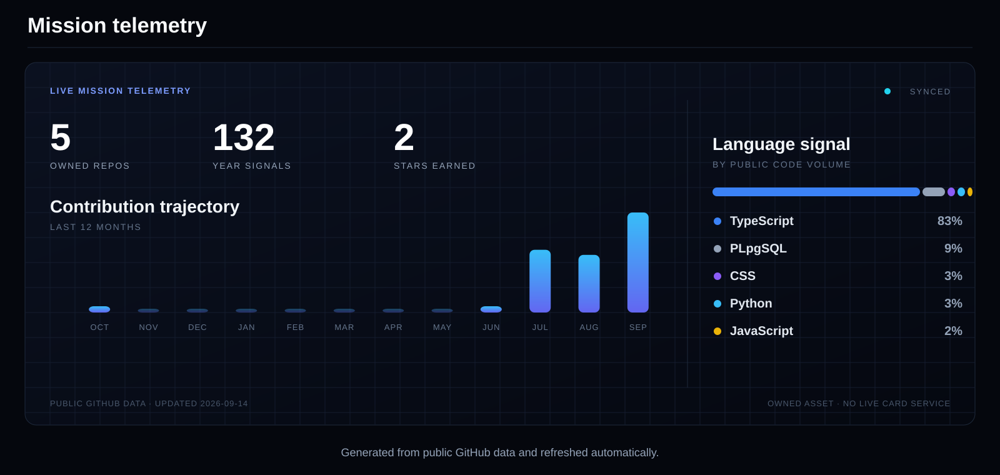

  <picture>
    <source media="(prefers-reduced-motion: reduce)" srcset="assets/banner.png">
    
  </picture>

  <strong>I build AI systems where the model, interface, and explanation move as one.</strong> 
  Agentic products · applied machine learning · developer tools

 

## Tech Arsenal

#### Languages

  
  

#### ML / AI

  
  
  

#### Tools

  
  
  
  
  
  
  

#### Competitive Programming

  
  
  

 

## Selected Projects

### [Comic Code](https://github.com/thotashashank302/Code-Comic)

Turns selected source files into a grounded four-panel visual explanation, connecting a Chrome side panel, a Next.js product, read-only GitHub integration, private storage, and durable background jobs.

`TypeScript` · `Next.js` · `Chrome Extension` · `GitHub Apps` · `Supabase` · `Trigger.dev`

### [Delinquency Prediction Model with AI Agent](https://github.com/thotashashank302/Delinquency-Prediction-Model-With-AI-AGENT)

Predicts credit-card delinquency, assigns a risk band, and supports human-reviewed outreach for moderate-risk customers.

`Python` · `Pandas` · `scikit-learn` · `Random Forest` · `AI Agent`

### New Life

An exploratory AI-agent concept for maternal-health awareness: supporting reminders, identifying possible risk indicators, and helping escalate concerns to a doctor.

Concept only—not a certified medical product or a replacement for professional medical care.

 

## Mission Telemetry

 

## Contribution Snake

<picture>
  <source media="(prefers-color-scheme: dark)" srcset="assets/snake-dark.svg">
  <source media="(prefers-color-scheme: light)" srcset="assets/snake-light.svg">
  
</picture>

 

---

  <strong>BUILD USEFUL THINGS. EXPLAIN THEM CLEARLY.</strong>

