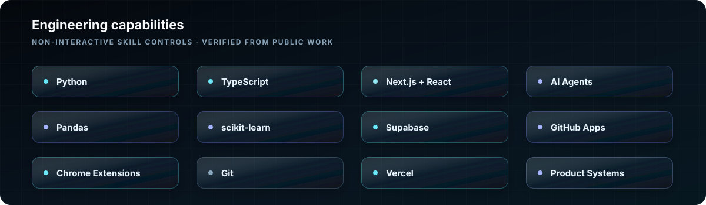
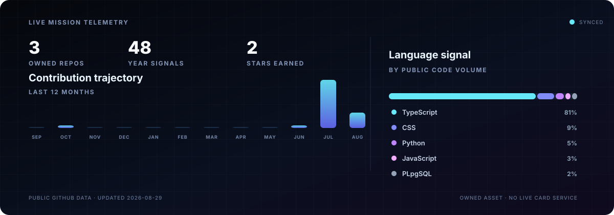

<picture>
  <source media="(prefers-reduced-motion: reduce)" srcset="./assets/profile-hero-cherry-poster.png">
  
</picture>

Shashank Thota
  <a href="https://comic-code.vercel.app"><strong>Launch Comic Code</strong></a>
  &nbsp;·&nbsp;
  <a href="https://github.com/thotashashank302?tab=repositories">Explore the work</a>
  &nbsp;·&nbsp;
  <a href="https://www.linkedin.com/in/thota-shashank-96878934b">LinkedIn</a>

---

### `> whoami`

> I build AI systems where the model, interface and explanation work as one.
>
> **Current signal:** agentic products · applied ML · developer experience
>
> **Operating principle:** build useful things, then explain them clearly.

## Skills console

<picture>
  <source media="(max-width: 600px)" srcset="./assets/skills-console-mobile.svg">
  
</picture>

Capability labels only — intentionally not linked.

## Selected systems

  

**Comic Code** turns selected source files into a grounded four-panel explanation of how the code works. It connects a Chrome side panel, a Next.js product, read-only GitHub integration, private storage and durable background jobs.

`TypeScript` · `Next.js` · `Chrome Extension` · `GitHub Apps` · `Supabase` · `Trigger.dev`

**[Open the live product →](https://comic-code.vercel.app)** &nbsp;&nbsp; **[Read the source →](https://github.com/thotashashank302/Code-Comic)**

  

An AI-powered system that predicts credit-card delinquency, assigns a risk band and lets an operator approve an email reminder for moderate-risk customers.

`Python` · `Pandas` · `scikit-learn` · `Random Forest` · `AI Agent`

**[Explore the model and agent →](https://github.com/thotashashank302/Delinquency-Prediction-Model-With-AI-AGENT)**

  

<strong>Read the concept boundary</strong>

 

An exploratory AI-agent concept for maternal-health awareness: supporting reminders, identifying possible risk indicators and helping escalate concerns to a doctor.

It is not a certified medical product or a replacement for professional medical care.

---

## Mission telemetry

  

Generated from public GitHub data and refreshed automatically.

## Contribution snake

<picture>
  <source media="(prefers-color-scheme: dark)" srcset="https://raw.githubusercontent.com/thotashashank302/thotashashank302/output/github-contribution-grid-snake-dark.svg">
  <source media="(prefers-color-scheme: light)" srcset="https://raw.githubusercontent.com/thotashashank302/thotashashank302/output/github-contribution-grid-snake.svg">
  
</picture>

  The grid is generated from my real contribution history and updates every day.

---

  <strong>BUILD USEFUL THINGS. EXPLAIN THEM CLEARLY.</strong> 
  AI systems · Agentic products · Developer tools

